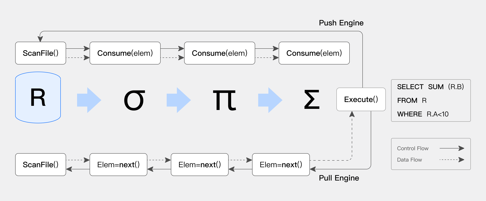

**Doris 的pipeline是什么,原理是什么,目的是什么,底层逻辑是什么, 怎么利用多核cpu资源的**

## 认知和原理
当前的 Doris 的 SQL 执行引擎是基于传统的火山模型([想想什么是火山模型,为什么不好?](huoshan_arc.md))进行设计，在单机多核的场景下存在下面的一些问题：

无法充分利用多核计算能力，提升查询性能，多数场景下进行性能调优时需要手动设置并行度，在生产环境中几乎很难进行设定。

单机查询的每个 Instance 对应线程池的一个线程，这会带来额外的两个问题。

线程池一旦打满。Doris 的查询引擎会进入假性死锁，对后续的查询无法响应。同时有一定概率进入逻辑死锁的情况：比如所有的线程都在执行一个 Instance 的 Probe 任务。
阻塞的算子会占用线程资源，而阻塞的线程资源无法让渡给能够调度的 Instance，整体资源利用率上不去。
阻塞算子依赖操作系统的线程调度机制，线程切换开销较大（尤其在系统混布的场景中）

由此带来的一系列问题驱动 Doris 需要实现适应现代多核 CPU 的体系结构的执行引擎。

而如下图所示（引用自[Push versus pull-based loop fusion in query engines](jfp_1800010a (cambridge.org))），Pipeline 执行引擎基于多核 CPU 的特点，重新设计由数据驱动的执行引擎

1. 将传统 Pull 拉取的逻辑驱动的执行流程改造为 Push 模型的数据驱动的执行引擎
2. 阻塞操作异步化，减少了线程切换，线程阻塞导致的执行开销，对于 CPU 的利用更为高效
3. 控制了执行线程的数目，通过时间片的切换的控制，在混合负载的场景中，减少大查询对于小查询的资源挤占问题

从而提高了 CPU 在混合负载 SQL 上执行时的效率，提升了 SQL 查询的性能。

